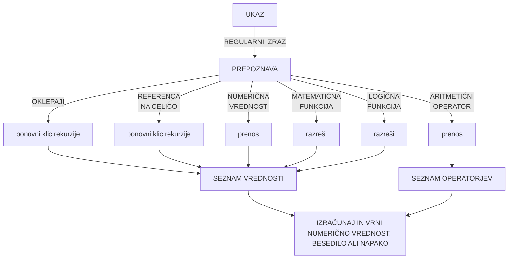
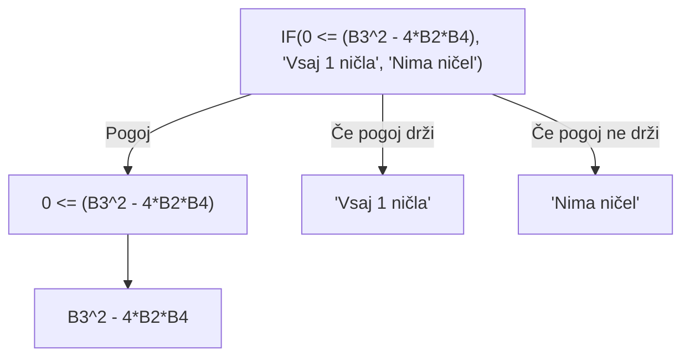

<h3 class="pb-15">
Mednarodna Elektrotehniška in računalniška konferenca 2022
</h3>

<h1 class="text-4xl leading-13 font-600"> Razširitev označevalnega jezika Markdown z aritmetičnimi operacijami, <br> matematičnimi in logičnimi funkcijami</h1>

<div class="pt-25">
  Univerza v Mariboru <br>
  Fakulteta za elektrotehniko, računalništvo in informatiko

</div>


<div class="abs-bl m-6 flex gap-2">
  Aleks Marinič, <span class="italic">študent</span>
</div>

<div class="abs-br m-6 flex gap-2">
  <span class="italic">izr. prof. dr.</span> Tomaž Kosar

</div>

---
layout: image-right
image: /students-on-computers.jpg
---

# Študent

- Uporaba računalnika ob predavanjih in računalniških vajah
- Potreba po orodju za izdelavo zapiskov

<br><br>

# Potrebe
- Brezplačno programje
- Vizualno oblikovani zapiski (za lažje učenje)
- Hitro pisanje in oblikovanje zapiskov
- Preprosta uporaba

---

# Markdown
- Označevalni jezik za prevajanje surovega besedila v HTML, PDF in podobne dokumente
  - kratka in preprosta sintaksa
  - nepotrebna uporaba miške
  - lahko berljiva koda

<div grid="~ cols-2 gap-2" m="-t-2">
  <div m="-t-2">
    <br><h1>Trilium</h1> 
    Orodje za izdelavo zapiskov z Markdown označevalnim jezikom in realnočasovnim predogledom
    <br><br>
    <h2 class="">Trajna rešitev?</h2>
    <br>
    Manjkajoče možnosti računanja podatkov
  </div>
  
</div>

---
layout: two-cols
---

# Rešitev

- Razširjanje **Marked** prevajalnika (https://github.com/markedjs/marked)
- Dodajanje matematičnih/logičnih funkcij in aritmetičnih operacij
- **Preprosta** in uporabnikom **poznana sintaksa** (podobna formulam Microsoft Excel)
- V obliki **JavaScript skripte**
- Preprosta integracija

::right::

<div class="grid-rows-2" m="-t-2">

```md
### Analiza starostne tabele

| starost | število         | delež           |
| ------- | --------------- | --------------- |
| 0-10    | 20              | ==b1/b7*100== % |
| 11-20   | 30              | ==b2/b7*100== % |
| 21-30   | 75              | ==b3/b7*100== % |
| 31-40   | 35              | ==b4/b7*100== % |
| 41-50   | 45              | ==b5/b7*100== % |
| nad 50  | 45              | ==b6/b7*100== % |
| vsi     | ==sum(b1-b6)==  | ==b7/b7*100== % |

```


</div>
---

# Podobna sintaksa

|   **Microsoft Excel formule**  |  **Formule za razširjeni Markdown prevajalnik**   |
| --- | --- |
| <tt>=SUM(A1:B6)</tt> | <tt>==SUM(A1-B6)==</tt> |
| <tt>=MIN(A1:B6)</tt> | <tt>==MIN(A1-B6)==</tt> |
| <tt>=MAX(A1:B6)</tt> | <tt>==MAX(A1-B6)==</tt> |
| <tt>=AVERAGE(A1:B6)</tt> | <tt>==AVG(A1-B6)==</tt> |
| <tt>=IF(A1<500,"Poceni","Predrago")</tt> | <tt>==IF(A1<500,"Poceni","Predrago")==</tt> |

---
layout: image-left
image: /programming.jpeg
---

# Programska izvedba

- Prepoznava ukazov preko **regularnih izrazov**
- Rekurzivno reševanje problemov (princip **deli in vladaj**)
- Iterativno **preprečevanje klicev** rekurzije **v neskončnost**
- Uporaba **prednostnih operacij** s pomočjo zank in polj
- Prepoznava in **ločevanje napak** na semantične in sintaktične
- Napredna **prepoznava številčnih vrednosti** iz celic z besedilom

---

# Reševanje formule

<div class="text-center">



</div>

---

<div class="grid grid-cols-2">

<div>

# Reševanje formule

- Posamezni tipi ukazov so **objekti v polju** in so sestavljeni iz:
  - regularnega izraza za hitro **detekcijo**,
  - regularnega izraza (ali funkcije) za **izluščeneje** njegovih **parametrov** in
  - funkcije za **razreševanje**
- Izluščeni parametri se obravnavajo s pomočjo klica rekurzije

</div>
<div>

### Primer:

<div class="text-center">

$f(x) = 4x^2 + 4x - 4$ <br>
$diskriminanta=b^2 - 4ac$


</div>

<div>


</div>
</div>
<div class="col-span-2">

```txt
| Oznaka        | Vrednosti                                                   |
| :-----------: | :---------------------------------------------------------: |
| a [x²]        | 4                                                           |
| b [x]         | 4                                                           |
| c             | -4                                                          |
| Šteivlo ničel | ==IF(0 <= (B3^2 - 4*B2*B4), 'Vsaj 1 ničla', 'Nima ničel')== |

```

</div>
</div>

---

<div class="grid grid-cols-2">

<div>

# Reševanje formule

- Imamo **5 klicev rekurzije**
- Naječjo **iteracijo zamika 3**:
  - **pogojni stavek** (kjer naredimo razrez, pogledamo pogoj in vrnemo odgovor)
  - **primerjalni operator**
  - račun znotraj **oklepajev**
- Odgovor pogoja znotraj pogojnega stavka ima lahko **vrednost** (1/0) ali **napako**
</div>
<div>

### Primer:

<div class="text-center">

$f(x) = 4x^2 + 4x - 4$ <br>
$diskriminanta=b^2 - 4ac$


</div>

<div>


</div>
</div>
<div class="col-span-2">

```txt
| Oznaka        | Vrednosti                                                   |
| :-----------: | :---------------------------------------------------------: |
| a [x²]        | 4                                                           |
| b [x]         | 4                                                           |
| c             | -4                                                          |
| Šteivlo ničel | ==IF(0 <= (B3^2 - 4*B2*B4), 'Vsaj 1 ničla', 'Nima ničel')== |

```

</div>
</div>

---

# Uporaba razširitve

- Razšrirjeni prevajalnik je **javno objavlen** in vsem dostopen na **GitHub repozitoriju**:
  - https://github.com/Linux-Alex/marked-with-table-functions
- Uporablja se lahko preko **JS skripte** v brskalniku:

<div class="grid grid-cols-2 gap-3">

```html
<!doctype html>
<html>
<head>
  <meta charset="utf-8"/>
  <title>Razširjeni Markdown</title>
</head>
<body>
  <div id="prevedena-koda"></div>
  <script src="./marked.min.js"></script>
  <script>
    document.getElementById('prevedena-koda').innerHTML =
      marked.parse(
        '# Naslov\nMoja koda z **oblikovano** vsebino.'
      );
  </script>
</body>
</html>
```


</div>

---
layout: cover
class: "text-center"
background: /feri.jpg
---

# Hvala za ogled

<div class="abs-bl m-6 flex gap-2">
  Aleks Marinič, <span class="italic">študent</span>
</div>

<div class="abs-br m-6 flex gap-2">
  Tomaž Kosar, <span class="italic">Doc. dr.</span>
</div>